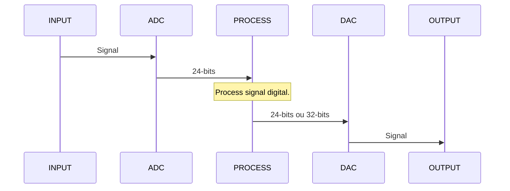

# Module D/A signal audio

Hi, it's project the module for input/output signal to computer signal.

# Features

- 5V or 3.3v power supply;
- ADC: 24bit;
- Frequence samples ADC max: 128;
- DAC: 24bit or 32bit;
- Frequence samples DAC max: 64;
- Stereo Input signal audio;
- Stereo Output signal audio;
- Connection  via i2s;

## Application 

Used for signal the audio purpose.

## Function Diagram

## Alert
module still in test and subject to change.

## I2S for Blackpill(STM32F411CEU6)
The STMicroelectronics provides an documention know emulation I2S used SPI and TIMER. overview in the link [Emulation I2S](https://www.st.com/resource/en/application_note/an5086-i2s-protocol-emulation-on-stm32l0-series-microcontrollers-using-a-standard-spi-peripheral-stmicroelectronics.pdf).